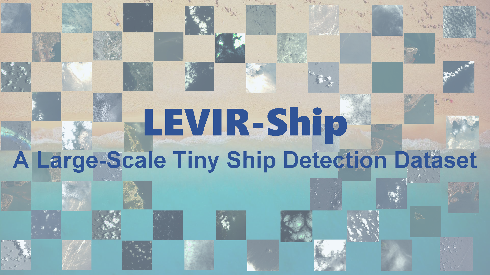
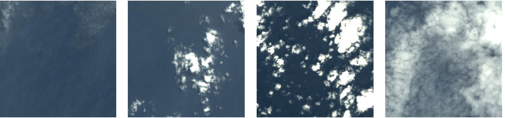
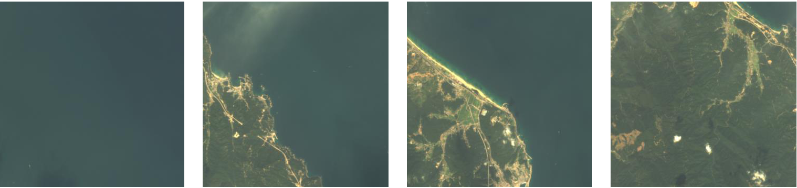
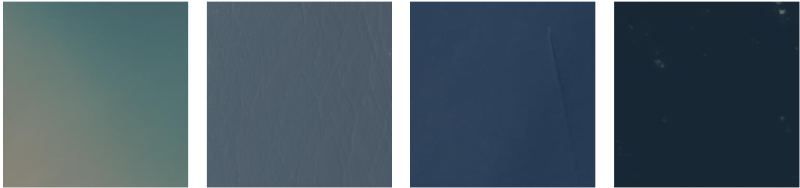
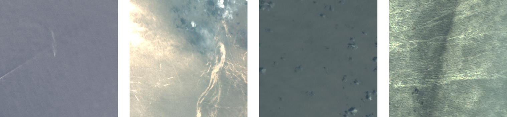

# LEVIR-Ship: A Large-Scale Tiny Ship Detection Dataset under Medium-Resolution Remote Sensing Images


[](#License)


## Share us a :star: if this repo does help

This is the official release of the LEVIR-Ship dataset in "A Degraded Reconstruction Enhancement-based Method for Tiny Ship Detection in Remote Sensing Images with A New Large-scale Dataset" [[IEEE](https://ieeexplore.ieee.org/document/9791363) | [Lab Server](http://levir.buaa.edu.cn/publications/DRENet.pdf)]. ***(Accepted by TGRS 2022)***

If you encounter any question, please feel free to contact us. You can create an issue or just send email to me windvchen@gmail.com. Also welcome for any idea exchange and discussion.

## Updates

***06/11/2022***
 
The **LEVIR-Ship** dataset and some useful tools are released.

***06/10/2022***
 
We will complete the arrangement of the dataset and its related tools within three days and make it public here. Please be patient.


## Table of Contents

- [Introduction](#Introduction)
- [Download Source](#Download-Source)
- [Attribute](#Attribute)
- [Tools](#Tools)
- [Citation](#Citation)
- [License](#License)

## Introduction


Images in **LEVIR-Ship** are captured from multispectral cameras of **GaoFen-1 and GaoFen-6** satellites with a spatial resolution of ***16m***. We only use the R, G, and B bands. 85 scenes have been collected in the dataset with pixel resolutions between 10000×10000 and 50000×20000. We crop the original images to finally get 1973 positive samples and 1903 negative samples with the size of 512×512. 

To our most knowledge, LEVIR-Ship is **the first public tiny ship detection dataset specific to medium-resolution remote sensing images**.

## Download Source

### For the whole dataset

- All Annotations: [[Google Drive](https://drive.google.com/file/d/1YppN3c2WQtuwI0cwQL2otLgW7ewFW_Ut/view?usp=sharing)  &#124; [Baidu Pan](https://pan.baidu.com/s/1b--sluUHUkgTuZqZCMkXbA) (code:6pr3)]
  
  The annotations are in Yolo format, i.e., [class, x_center, y_center, width, height]. If you need COCO format, you can refer to the following provided transformation [tools](#Tools). 
  
- All Images: [[Google Drive](https://drive.google.com/file/d/1cK0A9LQn97dDj_lg0Zvvgus0njFvN_JN/view?usp=sharing)  &#124; [Baidu Pan](https://pan.baidu.com/s/1KW2mOVbRMqi8IlR4sMhnww) (code:s1m9)]

### For the partitioned dataset used in [DRENet](https://github.com/WindVChen/DRENet)

**YOLO Format**

- Train Set: [[Google Drive](https://drive.google.com/file/d/1_kjTr4mpF1g2fWhAodKZXrsZjWrCfPh5/view?usp=sharing)  &#124; [Baidu Pan](https://pan.baidu.com/s/19s-lAXKnAf1rNE6Q42FMdg) (code:7m1v)]
- Valid Set: [[Google Drive](https://drive.google.com/file/d/1q2KFLVYU1SbeSU4Uksj6FV9C28YmUsb1/view?usp=sharing)  &#124; [Baidu Pan](https://pan.baidu.com/s/1NZ9rKqoiosMK1XCYMiFTAQ) (code:qgn3)]
- Test Set: [[Google Drive](https://drive.google.com/file/d/1SRq7hq7glKzzePWqtSlt0C_RVtc1pQQC/view?usp=sharing)  &#124; [Baidu Pan](https://pan.baidu.com/s/1ICF5U1kjh1OjmZP83u7UfQ) (code:diae)]

  *The above download sources have also included the **degraded images***.

**COCO Format**

- Annotations: [[Google Drive](https://drive.google.com/file/d/18M6-lnHl9V9Jf06wIpe3cX-aZE67DqHM/view?usp=sharing)  &#124; [Baidu Pan](https://pan.baidu.com/s/1WgNMZcu0FzfvtZXaGMIMZA) (code:d5d7)]
- Images: [[Google Drive](https://drive.google.com/file/d/1ItolDrLdSN0R-AnKbD90ngSWMtKOCUaY/view?usp=sharing)  &#124; [Baidu Pan](https://pan.baidu.com/s/1BRxf5T6QnDG57KXC6dCCgA) (code:dv7u)]


## Attribute
### Compared with other datasets 
| Dataset | Images Number |Instances Number | Source | Resolution | Year |
|:---|:---:|:---:|:---:| :---:| :---:|
| NWPU VHR-10 | 57 | 302 | Google Earth | 0.5-2m | 2014 |
| HRSC2016 | 1070 | 2976 | Google Earth | 0.4-2m |  2016 |
| DIOR | 2702 | 62400 | Google Earth | 0.5-30m | 2018 |
| HRRSD | 2165 | 3886 | Google Earth & Baidu Earth | 0.15-1.2m | 2019 |
| **LEVIR-Ship** | 3896 | 3219 | GaoFen-1 & GaoFen-6  | **16m** | 2021 |

### Examples of different situations

Images in LEVIR-Ship show very different conditions, due to the influence of different time, different photographers, and different locations, which can bring many challenges to the tiny ship detection task. In other words, LEVIR-Ship is much closer to the **real world situations**, compared to some Google Earth-based datasets whose images are usually clean and cloudless. Thus, LEVIR-Ship can bring networks **better generalization, stability, and sufficiency**.

**Different amount of cloud**


**Different percentages of land coverage**


**Different light intensity**


**Different sea area characteristics**


## Tools
In this repo, we provide some useful tools for dataset visualization and process.

- [Partition_LEVIR-Ship.py](Partition_LEVIR-Ship.py) is for partitioning the LEVIR-Ship dataset into Train Set, Valid Set, and Test Set. You can set the partition ratio in it.
- [Transformation_LEVIR-Ship_Yolo2COCO.py](Transformation_LEVIR-Ship_Yolo2COCO.py) is for transforming the YOLO format to COCO format, i.e., from [x_center, y_center, width, height] to [left, top, width, height].
- [Visualization_LEVIR-Ship_YoloFormat.py](Visualization_LEVIR-Ship_YoloFormat.py) is for display our Yolo annotations on the images.
- [Visualization_LEVIR-Ship_COCOFormat.py](Visualization_LEVIR-Ship_COCOFormat.py) is for display our COCO annotations on the images.
- [DegradeGenerate.py](DegradeGenerate.py) is for generating degraded images for DRENet, the details can be referred to [here](https://github.com/WindVChen/DRENet).

## Citation
If you make use of LEVIR-Ship dataset in your research, please cite:
```
@ARTICLE{9791363,
  author={Chen, Jianqi and Chen, Keyan and Chen, Hao and Zou, Zhengxia and Shi, Zhenwei},
  journal={IEEE Transactions on Geoscience and Remote Sensing},
  title={A Degraded Reconstruction Enhancement-based Method for Tiny Ship Detection in Remote Sensing Images with A New Large-scale Dataset},
  year={2022},
  volume={},
  number={},
  pages={1-1},
  doi={10.1109/TGRS.2022.3180894}}
```

## License
The codes of this project is licensed under the MIT License. See [LICENSE](LICENSE) for details.

The annotations in the LEVIR-Ship dataset are licensed under a [Creative Commons Attribution 4.0 License](https://creativecommons.org/licenses/by/4.0/legalcode).


We do not own the copyright of the images. Use of the images must abide by [China Centre For Resources Satellite Data and Application Terms of Use](http://36.112.130.153:7777/DSSPlatform/index.html).
